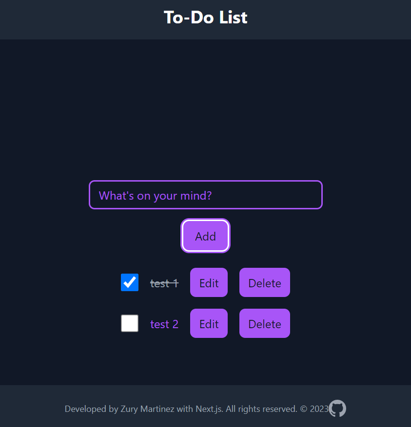

This is a simple application built with Next.js and Prisma DB that uses a custom API to perform CRUD operations. The user interface consists of a form where the user can enter a description for a task, and a button to add the task to the list. Each task in the list is displayed with a checkbox to mark it as completed, a "Edit" button to edit the task description and a "Delete" button to remove the task from the list. The "Edit" button opens a modal where the user can update the task description.

The application uses React hooks such as useState and useEffect to manage state and handle API requests using axios. The API endpoints for performing CRUD operations are implemented in the "task.js" file. The application also uses Modal component from the react-modal library to display the edit form.

This application is a good example of how to create a simple full-stack application with Next.js and a custom API using Prisma.

Can you try the application that is deployed on Vercel

